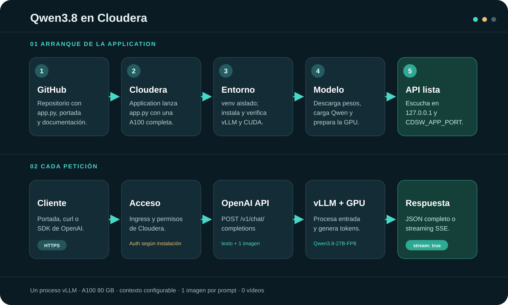

# Qwen3.8-27B-FP8 en Cloudera AI Workbench

<p align="center">
  <strong>Una Application · una A100 · una API OpenAI compatible</strong><br>
  Texto e imagen de entrada · respuestas en JSON o streaming SSE · probador web integrado
</p>



[Abrir la infografía a tamaño completo](assets/architecture.svg)

Este proyecto sirve `Qwen/Qwen3.8-27B-FP8` con **vLLM 0.29.0+cu129** dentro de una **Cloudera AI Workbench Application**. Al abrir su URL aparece una portada para probar el modelo con un mensaje, una imagen opcional y controles de generación. La misma URL ofrece `/v1/chat/completions` para clientes HTTP y SDK compatibles con OpenAI.

> **Estado de la prueba en Cloudera:** los logs compartidos muestran el modelo cargado y `Application startup complete`. Eso confirma el arranque del servidor; la primera petición desde la portada o la API confirma la inferencia de extremo a extremo.

**Ir a:** [Instalación](#instalación-paso-a-paso) · [Primera prueba](#primera-prueba) · [API](#llamar-a-la-api) · [Parámetros](#parámetros-de-generación) · [Problemas frecuentes](#problemas-frecuentes)

## Qué hace cada pieza

| Pieza | Responsabilidad |
| --- | --- |
| `app.py` | Detecta el puerto de Cloudera, crea o reutiliza un virtualenv aislado, instala y valida dependencias, y arranca vLLM. |
| `qwen_home.py` + `qwen_home.html` | Añaden la portada y el probador en `/`; las rutas de API siguen atendidas por vLLM. |
| vLLM | Carga el modelo en la A100 y sirve la API OpenAI compatible, incluido streaming SSE. |
| Cloudera Application | Mantiene el proceso en ejecución y publica su URL mediante el ingress de la instalación. |

El primer arranque descarga dependencias y pesos. Los siguientes arranques reutilizan el entorno validado y, si la caché persiste, los pesos descargados. Cuando Cloudera ejecuta `app.py` como celdas de Jupyter, el kernel permanece activo mientras vLLM sirve peticiones.

## Requisitos antes de empezar

| Recurso | Configuración recomendada |
| --- | --- |
| Producto | Cloudera AI Workbench, como **Application** dentro de un proyecto. |
| Runtime | **Nvidia GPU Edition** con Python **3.11**. El código acepta Python 3.10–3.13; la prueba aportada se hizo con 3.11. |
| GPU | **Una A100 completa de 80 GB**, sin MIG. |
| CPU y RAM | Al menos **8 vCPU y 64 GiB**; preferibles 16 vCPU y 128 GiB si están disponibles. |
| Disco | Espacio para el virtualenv, las descargas y el modelo; los checkpoints observados ocupan **28,75 GiB** antes de contar el resto. |
| Red | Acceso HTTPS a GitHub Releases, PyPI, el índice PyTorch y Hugging Face, o mirrors internos equivalentes. |

El proyecto no necesita ejecutar `requirements.txt` ni `cdsw-build.sh`. El bootstrap instala vLLM en su propio virtualenv y utiliza Python en modo aislado para evitar conflictos con los paquetes que añade Cloudera.

## Instalación paso a paso

### 1. Crear el proyecto desde Git

En **Projects → New Project**, elige la opción de Git y usa:

```text
https://github.com/smerchanmole/qwen38-27bfp8-cloudera-app-for-stream.git
```

Comprueba que el proyecto contiene `app.py`, `qwen_home.py` y `qwen_home.html`. Cloudera documenta la [creación de proyectos desde un repositorio Git](https://docs.cloudera.com/machine-learning/cloud/projects/topics/ml-projects.html).

### 2. Crear la Application

Desde el proyecto, entra en **Applications → New Application** y configura:

| Campo | Valor |
| --- | --- |
| Nombre | Por ejemplo, `qwen38-stream` |
| Script | `app.py` |
| Runtime | Nvidia GPU Edition, Python 3.11 |
| Recursos | 1 A100 80 GB completa; CPU y RAM según la tabla anterior |
| Variables | Solo las que necesites de [Configuración del servidor](#configuración-del-servidor) |

Pulsa **Create Application**. El script obtiene `CDSW_APP_PORT` del entorno y escucha únicamente en `127.0.0.1:$CDSW_APP_PORT`; **no introduzcas host ni puerto manualmente**. Esta secuencia sigue el flujo de [Analytical Applications de Cloudera](https://docs.cloudera.com/machine-learning/cloud/applications/index.html).

### 3. Esperar el primer arranque

El arranque hace, en orden:

1. Crea un virtualenv versionado en el proyecto.
2. Instala pip, vLLM con CUDA 12.9 y Transformers 5.15.0.
3. Ejecuta `pip check` y valida versiones de Torch, CUDA, vLLM y Transformers.
4. Copia el módulo de la portada al virtualenv y carga `Qwen/Qwen3.8-27B-FP8`.
5. Prepara la caché KV y publica la API en el puerto asignado por Cloudera.

La primera descarga y carga puede tardar varios minutos; en los logs de referencia transcurrieron unos diez minutos hasta la línea `Application startup complete`. Son señales útiles:

```text
[qwen-app] Reusing validated environment: ...
Starting vLLM server on http://127.0.0.1:<CDSW_APP_PORT>
Application startup complete.
```

La primera línea aparece en reinicios posteriores. El criterio de arranque es la última. Advertencias sobre `HF_TOKEN` ausente, Marlin FP8 en A100, NFS o `enforce_eager` no impidieron que el servidor arrancase en la prueba compartida.

## Primera prueba

1. Abre la **URL de la Application** desde Cloudera. Debe aparecer la portada «Tu modelo Qwen3.8 está disponible como API».
2. En **Prueba el modelo aquí**, escribe una pregunta corta y pulsa **Enviar prueba**. La respuesta aparece en la misma página.
3. Adjunta una imagen PNG, JPEG o WebP si quieres probar visión. El formulario admite **una imagen de hasta 10 MiB**.
4. Activa o desactiva **Streaming SSE** para comparar la respuesta por fragmentos con la respuesta completa.
5. Comprueba las rutas [`/health`](#rutas-disponibles) y [`/v1/models`](#rutas-disponibles). Si cambiaste `QWEN_SERVED_MODEL_NAME`, utiliza el nombre que devuelve `/v1/models`.

Los controles empiezan con `temperature=1`, `top_p=0.95` y `top_k=20`, los valores de `generation_config.json` que aparecen en los logs. `max_tokens=256` es **solo un valor cómodo para probar**, no un límite fijo del servidor. Los campos `seed` y `stop` quedan vacíos.

### Rutas disponibles

| Método y ruta | Para qué sirve |
| --- | --- |
| `GET /` | Portada, ejemplos y probador interactivo. |
| `GET /health` | Comprobar disponibilidad del servidor. |
| `GET /v1/models` | Consultar el nombre del modelo servido. |
| `POST /v1/chat/completions` | Chat con texto o una imagen; JSON o SSE. |
| `GET /docs` | Esquema OpenAPI interactivo de la instancia. |

El servidor también registra otras rutas, como `/v1/responses` y `/v1/completions`. Consulta `/docs` para los cuerpos y campos exactos de la versión desplegada; la portada usa la ruta de chat.

## Llamar a la API

Define `APP_URL` como la URL pública de tu Application, **sin `/v1` al final**. La URL que aparece en los logs (`127.0.0.1:8100` en la prueba) es interna y no sirve desde otro equipo.

### Terminal: respuesta en streaming

```bash
APP_URL="https://TU-APPLICATION"

curl -N "$APP_URL/v1/chat/completions" \
  -H "Content-Type: application/json" \
  -d '{"model":"qwen3.8-27b-fp8","messages":[{"role":"user","content":"Explica RAG en dos frases."}],"max_tokens":256,"stream":true}'
```

`curl -N` evita que el cliente acumule los fragmentos SSE. Si configuraste `QWEN_API_KEY` y el ingress deja pasar ese encabezado, añade `-H "Authorization: Bearer TU_CLAVE"`.

### Python: SDK de OpenAI

Instala el paquete `openai` **en el equipo cliente** si aún no lo tienes. El servidor ya lo instala dentro de su virtualenv.

```python
import os
from openai import OpenAI

client = OpenAI(
    base_url=os.environ["QWEN_APP_URL"].rstrip("/") + "/v1",
    api_key=os.getenv("QWEN_API_KEY", "EMPTY"),
)

stream = client.chat.completions.create(
    model="qwen3.8-27b-fp8",
    messages=[{"role": "user", "content": "Explica RAG en dos frases."}],
    max_tokens=256,
    stream=True,
    extra_body={"top_k": 20, "min_p": 0},
)

for chunk in stream:
    text = chunk.choices[0].delta.content
    if text:
        print(text, end="", flush=True)
```

El SDK exige un valor en `api_key`; `EMPTY` sirve solo cuando vLLM no tiene `QWEN_API_KEY` y el acceso de Cloudera permite esa llamada. Si necesitas probar con la autenticación de tu navegador, empieza por la portada.

### Imagen en una petición

El probador convierte la imagen elegida a un `data:` URL y la envía como una parte `image_url` junto al texto. Un cliente propio puede enviar el mismo formato:

```json
{
  "model": "qwen3.8-27b-fp8",
  "messages": [{
    "role": "user",
    "content": [
      {"type": "text", "text": "Describe la imagen."},
      {"type": "image_url", "image_url": {"url": "data:image/png;base64,<BASE64>"}}
    ]
  }],
  "max_tokens": 256
}
```

Con la configuración inicial se admite **una imagen por petición** y **ningún vídeo**. La salida del modelo es texto; esta Application no genera archivos de imagen o vídeo.

## Parámetros de generación

Estos campos van en el JSON de `/v1/chat/completions`. En el SDK de OpenAI, los campos específicos de vLLM (`top_k`, `min_p`, `repetition_penalty`) se pasan en `extra_body`. La [referencia de vLLM 0.29.0](https://docs.vllm.ai/en/v0.29.0/serving/online_serving/openai_compatible_server/) y `/docs` muestran la lista completa.

| Campo | Valor inicial del probador | Efecto |
| --- | ---: | --- |
| `model` | `qwen3.8-27b-fp8` | Nombre servido; consulta `/v1/models` si se modificó. |
| `messages` | Mensaje escrito | Historial de roles y contenido, incluida la imagen opcional. |
| `max_tokens` | `256` sugeridos | Máximo de tokens de salida de **esta petición**. |
| `stream` | `true` | Entrega fragmentos SSE; con `false` devuelve JSON completo. |
| `temperature` | `1.0` | Controla la variación; procede de la configuración del modelo. |
| `top_p` | `0.95` | Limita el muestreo por probabilidad acumulada. |
| `top_k` | `20` | Limita candidatos por paso; es un campo de vLLM. |
| `min_p` | `0` | Umbral relativo; cero lo deja sin efecto. |
| `repetition_penalty` | `1` | Penalización de repetición; uno es neutro. |
| `presence_penalty` / `frequency_penalty` | `0` / `0` | Ajustan la presencia y frecuencia de términos. |
| `seed` / `stop` | Vacíos | Semilla opcional y secuencia de parada opcional. |

El máximo de contexto del servidor es **262 144 tokens** por defecto. La entrada más la salida deben caber dentro de ese límite; `max_tokens` no amplía el contexto. vLLM admite además `response_format` y otros campos avanzados descritos en `/docs`.

## Configuración del servidor

Las siguientes son **variables de entorno de la Application**: se fijan antes de arrancar y no son parámetros de cada petición.

| Variable | Predeterminado | Cuándo cambiarla |
| --- | --- | --- |
| `QWEN_MODEL_ID` | `Qwen/Qwen3.8-27B-FP8` | Modelo o snapshot local. |
| `QWEN_SERVED_MODEL_NAME` | `qwen3.8-27b-fp8` | Nombre visible en `/v1/models`. |
| `QWEN_MAX_MODEL_LEN` | `262144` | Reducir contexto si necesitas liberar memoria. |
| `QWEN_MAX_NUM_SEQS` | `1` | Aumentar concurrencia solo después de medir memoria. |
| `QWEN_MAX_NUM_BATCHED_TOKENS` | `8192` | Tamaño del bloque de prefill. |
| `QWEN_GPU_MEMORY_UTILIZATION` | `0.90` | Fracción de memoria reservada; el código limita el valor a `0.95`. |
| `QWEN_KV_CACHE_DTYPE` | `bfloat16` | Mantener con Triton en A100 SM80. |
| `QWEN_ATTENTION_BACKEND` | `TRITON_ATTN` | Backend usado en la prueba. |
| `QWEN_ENFORCE_EAGER` | `true` | Perfil conservador; desactiva CUDA Graphs y compilación. |
| `QWEN_CPU_OFFLOAD_GB` | `0` | No necesario en la A100 usada en la prueba. |
| `QWEN_MAX_IMAGES_PER_PROMPT` | `1` | Número máximo de imágenes; el vídeo sigue en cero. |
| `QWEN_API_KEY` | Vacío | Activar Bearer para rutas de API protegidas por vLLM. |
| `HF_TOKEN` | Vacío | Guardar como secreto si necesitas más cuota de Hugging Face. |
| `HF_HOME` | Caché HF por defecto | Apuntar a almacenamiento persistente. |
| `QWEN_FORCE_REINSTALL` | `false` | Poner en `true` para reinstalar y revalidar el virtualenv en el siguiente arranque. |

**En redes cerradas:** `VLLM_WHEEL_URL`, `PYTORCH_INDEX_URL`, `QWEN_MODEL_ID` y `HF_HOME` permiten utilizar mirrors o snapshots internos. `VLLM_VERSION`, `VLLM_CUDA_VARIANT` y `TRANSFORMERS_VERSION` seleccionan versiones del stack; cambiarlas requiere validar compatibilidad.

**Opciones avanzadas:** `VLLM_USE_FLASHINFER_SAMPLER=0` evita el JIT del sampler FlashInfer que falló con el toolchain visto en el Runtime. `VLLM_ALLOWED_MEDIA_DOMAINS` limita dominios de imágenes remotas. Los parsers `QWEN_REASONING_PARSER` y `QWEN_TOOL_CALL_PARSER` están desactivados por defecto; prueba cada uno por separado si necesitas esas funciones.

### Autenticación y acceso externo

La autenticación de la **Application de Cloudera** y `QWEN_API_KEY` son capas distintas. Cloudera puede exigir sesión o permisos de proyecto para abrir la URL; si el ingress usa también `Authorization`, comprueba cómo llega ese encabezado a vLLM antes de activar una segunda clave. La [guía de seguridad de Cloudera](https://docs.cloudera.com/machine-learning/cloud/applications/topics/ml-securing-applications.html) explica permisos y acceso público.

La [documentación de seguridad de vLLM 0.29.0](https://docs.vllm.ai/en/v0.29.0/usage/security/) indica que `--api-key` protege prefijos concretos de API, no todas las rutas del servidor. Por ello, la política de acceso de la Application debe configurarse en Cloudera.

## Actualizar una instalación existente

Después de cada corrección subida a GitHub:

1. Actualiza el proyecto de Cloudera desde `main`. Si se creó como clon Git y no hay cambios locales, en el terminal del proyecto puedes ejecutar `git pull origin main`.
2. Comprueba que llegaron `app.py`, `qwen_home.py` y `qwen_home.html`.
3. **Reinicia la Application** desde Cloudera para que copie la portada actual y arranque el código nuevo.
4. Espera `Application startup complete` y repite una prueba breve desde `/`.

Los cambios solo de README no alteran el proceso. Los cambios de la portada se copian al virtualenv al arrancar; no necesitan reinstalar vLLM. Si cambias los selectores de dependencias, el bootstrap compara su sello y actualiza el entorno.

## Problemas frecuentes

| Síntoma | Qué significa y qué hacer |
| --- | --- |
| `NameError: __file__ is not defined` | Una versión anterior del script asumía ejecución como archivo. Actualiza el proyecto y reinicia; la versión actual reconoce la ejecución en celdas de Jupyter. |
| `pip check` muestra conflictos con `mlflow` o `cmladdons` | Una versión anterior dejaba entrar paquetes del Runtime en el virtualenv. Actualiza y reinicia; el Python actual se ejecuta con `-I` y limpia `PYTHONPATH`. |
| Advertencia de `HF_TOKEN` o de prefetch en NFS | Son avisos observados en la prueba; si el servidor termina en `Application startup complete`, no bloquean el arranque. `HF_TOKEN` puede mejorar los límites de descarga. |
| Aviso de Marlin FP8 en A100 | La A100 no tiene cálculo FP8 nativo; vLLM usa Marlin para los pesos. Puede afectar al rendimiento, pero el modelo cargó en la prueba. |
| La portada carga, pero una petición devuelve 401/403 o HTML | Revisa permisos/sesión de Cloudera, `QWEN_API_KEY` y el tratamiento del encabezado `Authorization` en el ingress. |
| `model not found` | Usa el `id` devuelto por `GET /v1/models` o ajusta `QWEN_SERVED_MODEL_NAME`. |
| El streaming llega de golpe | Comprueba el buffering y timeout del ingress o proxy; `curl -N` evita el buffering del lado cliente. |
| Falta memoria GPU | Comprueba que la A100 es completa y que no hay otra carga. Reduce `QWEN_MAX_MODEL_LEN` o la concurrencia antes de subir `QWEN_GPU_MEMORY_UTILIZATION`. |

## Alcance de esta Application

- Un proceso vLLM sirve un modelo en una A100. No se lanzan múltiples workers HTTP.
- El modelo acepta texto y, con la configuración inicial, una imagen por petición; no genera imágenes ni vídeo.
- `QWEN_MAX_NUM_BATCHED_TOKENS=8192` controla el bloque de prefill; **no** es un techo fijo de `max_tokens` en cada petición.
- Es una **Workbench Application** de larga duración. No aparece por sí sola en el catálogo de Cloudera AI Inference ni proporciona su escalado automático o ciclo de vida.

## Referencias

- [Crear una Cloudera AI Workbench Application](https://docs.cloudera.com/machine-learning/cloud/applications/index.html)
- [Proyectos Cloudera desde Git](https://docs.cloudera.com/machine-learning/cloud/projects/topics/ml-projects.html)
- [Seguridad de Applications en Cloudera](https://docs.cloudera.com/machine-learning/cloud/applications/topics/ml-securing-applications.html)
- [Servidor OpenAI compatible de vLLM 0.29.0](https://docs.vllm.ai/en/v0.29.0/serving/online_serving/openai_compatible_server/)
- [Seguridad de vLLM 0.29.0](https://docs.vllm.ai/en/v0.29.0/usage/security/)

<details>
<summary><strong>English summary</strong></summary>

This repository runs Qwen3.8-27B-FP8 as a long-lived Cloudera AI Workbench Application on one full A100 80 GB GPU. `app.py` builds an isolated, validated CUDA/vLLM environment and starts the OpenAI-compatible server on `127.0.0.1:$CDSW_APP_PORT`. The home page includes a text and image playground; `/v1/chat/completions` supports JSON and SSE streaming. Use the installation and troubleshooting sections above for deployment details.

</details>
